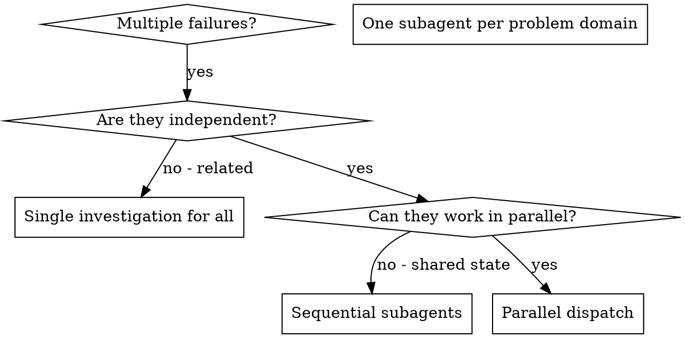

# Dispatching Parallel Agents

## Overview

When you have multiple unrelated failures (different test files, different subsystems, different bugs), investigating them sequentially wastes time. Each investigation is independent and can happen in parallel.

**Core principle:** Dispatch one read-only subagent per independent problem domain. Let them work concurrently.

## Reasonix Subagent Model

Reasonix's built-in subagent tools are **read-only investigators** that run on `deepseek-v4-flash`:

| Tool | Purpose |
|------|---------|
| `explore` | Wide-net codebase investigation — "find all places X", "how does Y work" |
| `research` | Web search + code reading — "is lib Z compatible", "compare impl against spec" |

Both tools return a distilled answer with file:line citations. Their reads and reasoning never enter your context log — you get only the conclusion.

**Key constraint:** Subagents are read-only. They cannot edit files, run commands, or make changes. They investigate and report back. YOU act on their findings.

## When to Use



**Use when:**
- 3+ test files failing with different root causes
- Multiple subsystems broken independently
- Each problem can be understood without context from others
- No shared state between investigations

**Don't use when:**
- Failures are related (fix one might fix others)
- Need to understand full system state
- Subagents would interfere with each other (editing same files — but since they're read-only, this is rare)

## The Pattern

### 1. Identify Independent Domains

Group failures by what's broken:
- File A tests: Tool approval flow
- File B tests: Batch completion behavior
- File C tests: Abort functionality

Each domain is independent — fixing tool approval doesn't affect abort tests.

### 2. Create Focused Subagent Tasks

Each `explore` task gets:
- **Specific scope:** One test file or subsystem
- **Clear goal:** "Find root cause of these 3 failures"
- **Constraints:** "Do NOT suggest changes — just identify root cause"
- **Expected output:** Summary with file:line citations

### 3. Dispatch in Parallel

In one tool-call batch, dispatch all investigations:

```
explore({ task: "Investigate 3 failing tests in src/agents/agent-tool-abort.test.ts:
1. 'should abort tool with partial output capture' — expects 'interrupted at' in message
2. 'should handle mixed completed and aborted tools' — fast tool aborted instead of completed
3. 'should properly track pendingToolCount' — expects 3 results but gets 0
Identify root cause for each. Return summary with file:line references." })

explore({ task: "Investigate 2 failing tests in src/agents/batch-completion-behavior.test.ts:
1. ... 2. ...
Identify root cause. Return summary with file:line." })

explore({ task: "Investigate 1 failing test in src/agents/tool-approval-race-conditions.test.ts:
...
Identify root cause. Return summary with file:line." })
```

All three run concurrently on `deepseek-v4-flash`.

### 4. Review and Integrate

When subagents return:
- Read each summary — they'll include file:line citations
- Verify findings don't conflict
- Implement fixes yourself using the investigation results
- Run full test suite via `run_command` to verify

## Subagent Prompt Structure

Good subagent prompts are:
1. **Focused** — One clear problem domain
2. **Self-contained** — All context needed (subagent has no parent context)
3. **Specific about output** — What exactly should the subagent return?

```
Investigate [specific failure] in [specific file].

Error: [paste exact error message]

Your task:
1. Read the relevant source files
2. Trace the data flow that leads to this error
3. Identify the root cause (not just the symptom)
4. Cite file:line for the offending code

Return: Root cause summary with file:line references.
Do NOT suggest fixes — just identify the root cause.
```

## Common Mistakes

**❌ Too broad:** "Fix all the tests" — subagent gets lost
**✅ Specific:** "Investigate 3 failures in agent-tool-abort.test.ts" — focused scope

**❌ No context:** "Fix the race condition" — subagent doesn't know where
**✅ Context:** Paste the error messages, test names, and file paths

**❌ Asking subagent to fix:** Subagents are read-only — they can't edit
**✅ Asking subagent to investigate:** "Identify root cause" — investigation only

**❌ Vague output:** "Look into it" — you don't know what you'll get
**✅ Specific:** "Return root cause summary with file:line references"

## When NOT to Use

**Related failures:** Fixing one might fix others — investigate together first
**Need full context:** Understanding requires seeing entire system — use direct `read_file`/`search_content` instead
**Exploratory debugging:** You don't know what's broken yet — use direct exploration first
**Implementation work:** Subagents are read-only — you must implement fixes yourself

## Key Benefits

1. **Parallelization** — Multiple investigations happen simultaneously on flash
2. **Context isolation** — Subagent reads don't pollute your prefix-cache
3. **Focus** — Each subagent has narrow scope, less context to track
4. **Cost efficiency** — Subagents run on `deepseek-v4-flash` (~$0.14/M input tokens)

## Verification

After implementing fixes based on subagent findings:
1. **Review each summary** — Understand what the subagent found
2. **Check for conflicts** — Did subagents identify conflicting root causes?
3. **Implement fixes** — Using `edit_file` based on investigation results
4. **Run full suite** — `run_command` to verify all fixes work together
5. **Spot check** — Subagents can make systematic errors; verify their conclusions

## Real-World Impact

From a debugging session:
- 6 failures across 3 files
- 3 `explore` subagents dispatched in parallel
- All root causes identified concurrently (~30s total)
- Fixes implemented based on findings
- Full suite green after fixes
- Zero conflicts between subagent findings
