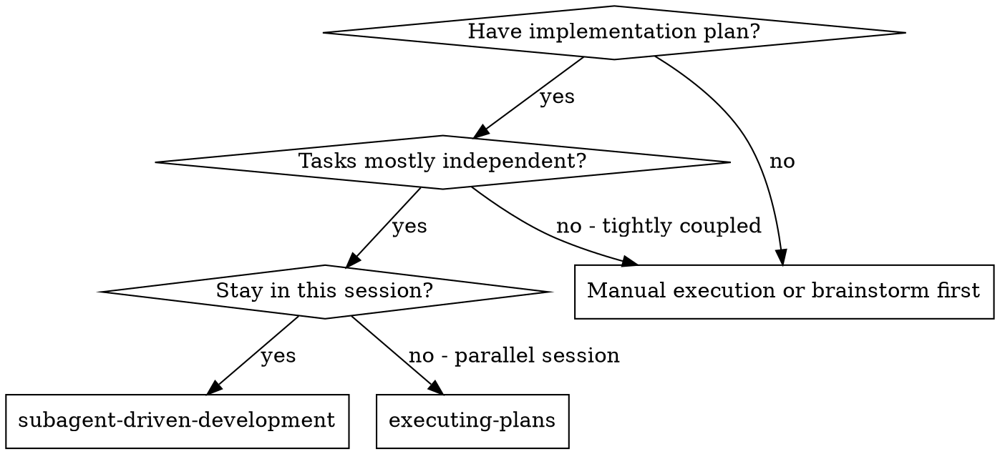
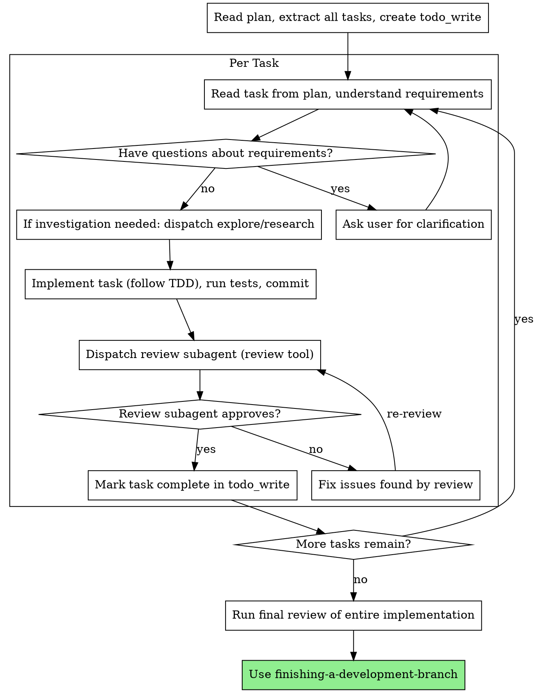

# Subagent-Driven Development

Execute plan task-by-task: you implement each task yourself, then dispatch read-only subagents for code review and investigation. Reasonix's subagent tools (`explore`, `research`, `review`, `security_review`) are **read-only by design** — they investigate, review, and verify, but never edit files.

**Core principle:** You implement → subagent reviews → fix issues → repeat. Fresh review perspective per task catches issues before they compound.

## When to Use



**vs. Executing Plans (parallel session):**
- Same session (no context switch)
- You implement each task yourself
- Code review after each task using `review` tool
- Investigation via `explore` / `research` subagents
- Faster iteration (no human-in-loop between tasks)

## The Process



## The Workflow

### Step 1: Read and Prepare

1. Read the plan file using `read_file`
2. Extract all tasks
3. Create a `todo_write` with all tasks listed as `pending`

### Step 2: Implement Each Task

For each task:

1. **Understand the task** — Read the full task spec from the plan
2. **Ask questions** — If anything is unclear, ask the user before starting. Use `ask_choice` for decision points
3. **Investigate if needed** — Use subagent tools for investigation:
   - `explore({ task: "Find how X works in this codebase" })` — codebase patterns, existing implementations
   - `research({ task: "Is library Y compatible with our Z setup? Check code + web" })` — external + internal research
4. **Implement** — Follow TDD: write failing test → watch it fail → write minimal code → watch it pass → commit
   - Use `run_skill({ name: "test-driven-development" })` to guide TDD
   - Use `edit_file` for SEARCH/REPLACE edits, `write_file` for new files
   - Use `run_command` to run tests
5. **Self-review** — Check your own work before submitting for review
6. **Commit** via `run_command`

### Step 3: Code Review

After implementing and committing each task:

```
review({ task: "Review Task N: [task description]. Check against plan requirements, correctness, security, missing tests." })
```

The `review` tool automatically checks the current branch diff — no SHAs needed. It returns a structured analysis with strengths and issues by severity.

For security-critical changes:
```
security_review({ task: "focus on auth token handling in src/auth/" })
```

**Act on feedback:**
- Fix Critical issues immediately
- Fix Important issues before proceeding
- Note Minor issues for later
- After fixes, re-run `review` to verify

### Step 4: Continue

- Mark task `completed` in `todo_write`
- Move to next task
- Repeat until all tasks done

### Step 5: Complete

After all tasks:
- Run final review: `review({ task: "Final review of entire feature implementation. Check all requirements met, integration quality." })`
- Use `run_skill({ name: "finishing-a-development-branch" })`

## Subagent Tools Reference

| Tool | Purpose | Model | Read/Write |
|------|---------|-------|------------|
| `explore` | Wide-net codebase investigation | flash | Read-only |
| `research` | Web search + code reading | flash | Read-only |
| `review` | Code review of current branch diff | flash | Read-only |
| `security_review` | Security-focused code review | flash | Read-only |

All subagents default to `deepseek-v4-flash` for cost efficiency. They are read-only — they can read files, search code, and check diffs, but cannot edit, write, or run commands.

## Example Workflow

```
You: I'm using Subagent-Driven Development to execute this plan.

[Read plan file: docs/plans/feature-plan.md]
[Extract all 5 tasks]
[Create todo_write with all tasks]

Task 1: Hook installation script

[Read Task 1 spec]
You: Before I begin — should the hook be installed at user or system level?

User: User level (~/.config/superpowers/hooks/)

You: Got it. Let me investigate the existing hook infrastructure first.
explore({ task: "Find existing hook installation patterns in the codebase. How are hooks currently registered and loaded?" })

[explore returns: Hooks live in hooks.json, loaded via hooks/hooks.json, installed by copying scripts to hooks/]
You: Clear. Implementing now...

[Write test → watch it fail → implement → watch it pass → commit]
[Tests: 5/5 pass]

review({ task: "Review Task 1: Hook installation script. Requirements: install-hook command at user level (~/.config/superpowers/hooks/). Check correctness, edge cases, test coverage." })

Review: ✅ Clean implementation. Tests cover all cases. One minor: consider adding a --dry-run flag.
You: Noted for later. Proceeding.

[Mark Task 1 complete]

Task 2: Recovery modes

[Read Task 2 spec]
[Implement following TDD]
[Tests: 8/8 pass]
[Commit]

review({ task: "Review Task 2: Recovery modes. Requirements: verify/repair modes with progress reporting every 100 items. Check spec compliance." })

Review: ⚠️ Issues:
  - Missing: Progress reporting (spec says "report every 100 items")
  - Minor: Magic number 100, extract as constant

[Fix issues via edit_file]
[Tests still pass: 8/8]
review({ task: "Re-review Task 2 after fixes. Confirm progress reporting added and constant extracted." })

Review: ✅ All issues resolved. Approved.

[Mark Task 2 complete]

...

[After all tasks]
review({ task: "Final review: all 5 tasks complete. Check integration, overall code quality, requirements coverage." })
Review: ✅ All requirements met, ready to merge.

run_skill({ name: "finishing-a-development-branch" })
Done!
```

## Advantages

**vs. Manual execution:**
- `review` catches issues before they compound
- `explore`/`research` save context on investigation tasks
- Fresh review perspective per task

**vs. Executing Plans:**
- Same session (no handoff)
- Continuous progress (no waiting between batches)
- Review integrated into task workflow

**Efficiency gains:**
- Subagent tools keep investigation context out of your main log (saves prefix-cache space)
- `review` tool is automated, no manual diff reading
- Issues caught immediately, not at merge time

## Red Flags

**Never:**
- Start implementation on main/master branch without explicit user consent
- Skip code review between tasks
- Proceed with unfixed Critical or Important issues
- Accept "close enough" on review findings — fix and re-review
- Move to next task while review has open issues

**If review finds issues:**
- Fix them immediately with `edit_file`
- Re-review after fixes
- Repeat until approved

**If stuck:**
- Use `explore` to investigate codebase patterns
- Use `run_skill({ name: "systematic-debugging" })` for debugging
- Ask user for clarification — don't guess

## Integration

**Required workflow skills:**
- **using-git-worktrees** — REQUIRED: Set up isolated workspace before starting. Use `run_skill({ name: "using-git-worktrees" })`
- **writing-plans** — Creates the plan this skill executes
- **test-driven-development** — Follow TDD for each task. Use `run_skill({ name: "test-driven-development" })`
- **finishing-a-development-branch** — Complete development after all tasks. Use `run_skill({ name: "finishing-a-development-branch" })`

**Alternative workflow:**
- **executing-plans** — Use for parallel session instead of same-session execution
