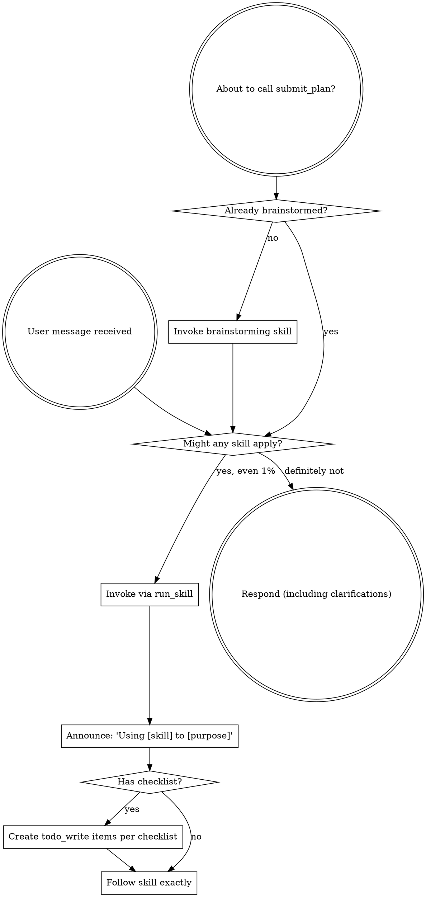

<EXTREMELY-IMPORTANT>
If you think there is even a 1% chance a skill might apply to what you are doing, you ABSOLUTELY MUST invoke the skill.

IF A SKILL APPLIES TO YOUR TASK, YOU DO NOT HAVE A CHOICE. YOU MUST USE IT.

This is not negotiable. This is not optional. You cannot rationalize your way out of this.
</EXTREMELY-IMPORTANT>

## How Skills Work in Reasonix

Reasonix loads skills from two locations:
- **Project skills:** `<project>/.reasonix/skills/<name>.md` — scoped to this workspace
- **Global skills:** `~/.reasonix/skills/<name>.md` — available everywhere
- **Claude-format skills** also load: `<project>/.claude/skills/<name>/SKILL.md`

Skills appear in the pinned Skills index in your system prompt. They are invoked via the `run_skill` tool:

```
run_skill({ name: "skill-name", arguments: "concrete task description" })
```

Or via slash command: `/skill skill-name`

**Skill types:**
- **inline** (default) — skill body is appended to your context; you read and follow it directly
- **subagent** (`runAs: subagent` in frontmatter) — spawns an isolated child loop on `deepseek-v4-flash`; only its final distilled answer comes back. Subagents are **read-only** — they can investigate but cannot edit files.

**When a skill says `runAs: subagent`, always pass `arguments`** — the subagent gets no other context.

## The Rule

**Invoke relevant or requested skills BEFORE any response or action.** Even a 1% chance a skill might apply means that you should invoke the skill to check. If an invoked skill turns out to be wrong for the situation, you don't need to use it.



## Red Flags

These thoughts mean STOP—you're rationalizing:

| Thought | Reality |
|---------|---------|
| "This is just a simple question" | Questions are tasks. Check for skills. |
| "I need more context first" | Skill check comes BEFORE clarifying questions. |
| "Let me explore the codebase first" | Skills tell you HOW to explore. Check first. |
| "I can check git/files quickly" | Files lack conversation context. Check for skills. |
| "Let me gather information first" | Skills tell you HOW to gather information. |
| "This doesn't need a formal skill" | If a skill exists, use it. |
| "I remember this skill" | Skills evolve. Read current version via `run_skill`. |
| "This doesn't count as a task" | Action = task. Check for skills. |
| "The skill is overkill" | Simple things become complex. Use it. |
| "I'll just do this one thing first" | Check BEFORE doing anything. |
| "This feels productive" | Undisciplined action wastes time. Skills prevent this. |
| "I know what that means" | Knowing the concept ≠ using the skill. Invoke it. |

## Skill Priority

When multiple skills could apply, use this order:

1. **Process skills first** (brainstorming, systematic-debugging) — these determine HOW to approach the task
2. **Implementation skills second** (test-driven-development, writing-plans) — these guide execution

"Let's build X" → brainstorming first, then implementation skills.
"Fix this bug" → systematic-debugging first, then domain-specific skills.

## Skill Types

**Rigid** (TDD, debugging): Follow exactly. Don't adapt away discipline. These skills enforce rules that must not be softened.

**Flexible** (patterns): Adapt principles to context. These skills provide guidance, not hard gates.

The skill itself tells you which type it is.

## DeepSeek-Specific Notes

- **Thinking mode:** For complex reasoning (design decisions, debugging root causes, architectural choices), Reasonix will engage DeepSeek's extended reasoning. Let it — the thinking blocks produce better results for hard problems.
- **Prefix cache:** Skills are loaded into the prefix and cached. Reading a skill via `run_skill` is cheap on subsequent invocations.
- **Flash vs Pro:** Skills default to your session's model. Complex subagent work can use `model: deepseek-v4-pro` in skill frontmatter.
- **Cost awareness:** Subagent skills spawn on `deepseek-v4-flash` by default (~$0.14/M input tokens). The parent session model is unchanged.

## User Instructions

Instructions say WHAT, not HOW. "Add X" or "Fix Y" doesn't mean skip workflows.

## Quick Reference

| Action | Reasonix Tool / Command |
|--------|------------------------|
| Invoke a skill | `run_skill({ name: "skill-name" })` or `/skill skill-name` |
| Create a skill | `/skill new skill-name` or `install_skill` tool |
| List skills | `/skill list` |
| Track tasks | `todo_write` tool or `/todo` |
| Submit plan for review | `submit_plan` tool |
| Ask user to choose | `ask_choice` tool |
| Switch to Pro model | `/pro` (next turn) or `/preset max` (session) |
| Run a shell command | `run_command` (gated — allowlisted) |
| Edit files | `edit_file` (SEARCH/REPLACE, exact match required) |
