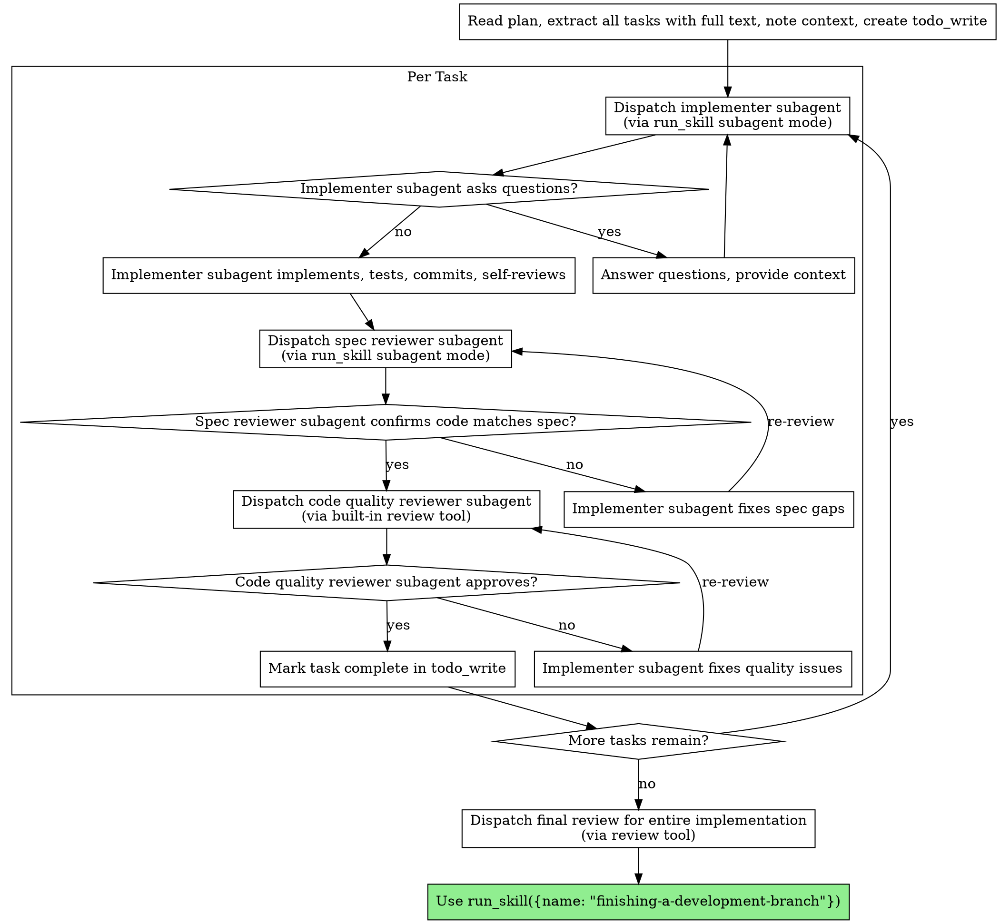

# Subagent-Driven Development (Reasonix 适配版)

Execute plan by dispatching fresh subagent per task, with two-stage review after each: spec compliance review first, then code quality review.

**Why subagents:** You delegate tasks to specialized agents with isolated context. By precisely crafting their instructions and context, you ensure they stay focused and succeed at their task. They should never inherit your session's context or history — you construct exactly what they need. This also preserves your own context for coordination work.

**Core principle:** Fresh subagent per task + two-stage review (spec then quality) = high quality, fast iteration

**Continuous execution:** Do not pause to check in with your human partner between tasks. Execute all tasks from the plan without stopping. The only reasons to stop are: BLOCKED status you cannot resolve, ambiguity that genuinely prevents progress, or all tasks complete.

## When to Use

Use when:
- You have an implementation plan with mostly independent tasks
- Tasks can be executed in the same session (no context switch needed)
- Each task can be dispatched to a focused subagent

Don't use when:
- No implementation plan exists yet (use brainstorming → writing-plans first)
- Tasks are so tightly coupled they must be done together
- Work needs to happen in a separate parallel session (use executing-plans instead)

## Reasonix Platform Notes

This skill is adapted from the original Claude Code superpowers. Key Reasonix equivalents:

| Claude Code | Reasonix |
|---|---|
| `Task` tool (dispatch subagent) | `run_skill` with subagent mode |
| `TodoWrite` | `todo_write` |
| `Skill` tool (read skill) | `run_skill` |
| `Bash` tool | `run_command` / `run_background` |
| `Read` tool | `read_file` |
| `superpowers:xxx` | `run_skill({name: "xxx"})` |

**Supported subagent tools in Reasonix:** `explore`, `research`, `review`, `security_review`, plus `run_skill` can spawn a full subagent with file read/write/command access.

## The Process



## How to Dispatch Subagents in Reasonix

### Dispatch an Implementer

The primary mechanism is `run_skill` with subagent mode:

```
run_skill({
  name: "subagent-implementer",
  arguments: "Implement Task N: [task name]

## Full Task Description

[Paste the complete task text from the plan — don't ask the subagent to read the plan file]

## Context

[Scene-setting: where this fits, dependencies, architectural context]

## Your Job

1. Implement exactly what the task specifies
2. Write tests first (TDD)
3. Verify implementation works
4. Commit your work
5. Self-review
6. Report back with status: DONE | DONE_WITH_CONCERNS | BLOCKED | NEEDS_CONTEXT

## Before You Begin

If you have questions about requirements, approach, or anything unclear:
Ask them now. It's always OK to pause and clarify.

## Self-Review Checklist

Completeness:
- Did I fully implement everything required?
- Did I miss any edge cases?

Quality:
- Are names clear and accurate?
- Is the code clean and maintainable?

Discipline:
- Did I avoid overbuilding (YAGNI)?
- Did I only build what was requested?"

})
```

Alternatively, for simpler tasks, the implementer can work inline in the current session.

### Dispatch a Spec Compliance Reviewer

```
run_skill({
  name: "subagent-spec-reviewer",
  arguments: "Review spec compliance for Task N

## What Was Requested

[FULL TEXT of task requirements]

## What Implementer Claims They Built

[From implementer's report]

## CRITICAL: Do Not Trust the Report

Verify everything independently by reading actual code.
Do NOT take their word for what they implemented.

Check:
- Missing requirements (skipped or missed?)
- Extra/unneeded work (built things not requested?)
- Misunderstandings (solved wrong problem?)

Report:
- ✅ Spec compliant (after code inspection)
- ❌ Issues found with file:line references"
})
```

### Dispatch a Code Quality Reviewer

Use the built-in `review` tool for code quality inspection:

```
review({
  task: "Code quality review for Task N.
  Review commit range: [BASE_SHA]..[HEAD_SHA]

  Check:
  - Does each file have one clear responsibility?
  - Are units independently testable?
  - Clean code? Magic numbers? Duplication?
  - Good test coverage?

  Report strengths, issues (Critical/Important/Minor), and assessment."
})
```

## Example Workflow

```
You: I'm using subagent-driven-development to execute this plan.

[Read plan file once]
[Extract all 5 tasks with full text and context]
[Create todo_write with all tasks]

Task 1: Hook installation script

[Get Task 1 text and context]
[Dispatch implementer via run_skill subagent with full task text + context]

Implementer: "Before I begin - should the hook be installed at user or system level?"

You: "User level (~/.config/superpowers/hooks/)"

Implementer: "Got it. Implementing now..."
[Later] Implementer:
  - Implemented install-hook command
  - Added tests, 5/5 passing
  - Self-review: Found I missed --force flag, added it
  - Committed

[Dispatch spec compliance reviewer]
Spec reviewer: ✅ Spec compliant - all requirements met, nothing extra

[Get git SHAs, dispatch code quality reviewer via review tool]
Code reviewer: Strengths: Good test coverage, clean. Issues: None. Approved.

[Mark Task 1 complete]

Task 2: Recovery modes

[Get Task 2 text and context]
[Dispatch implementer via run_skill subagent]

Implementer: [No questions, proceeds]
Implementer:
  - Added verify/repair modes
  - 8/8 tests passing
  - Self-review: All good
  - Committed

[Dispatch spec compliance reviewer]
Spec reviewer: ❌ Issues:
  - Missing: Progress reporting (spec says "report every 100 items")
  - Extra: Added --json flag (not requested)

[Implementer fixes issues]
Implementer: Removed --json flag, added progress reporting

[Spec reviewer reviews again]
Spec reviewer: ✅ Spec compliant now

[Dispatch code quality reviewer via review tool]
Code reviewer: Strengths: Solid. Issues (Important): Magic number (100)

[Implementer fixes]
Implementer: Extracted PROGRESS_INTERVAL constant

[Code reviewer reviews again]
Code reviewer: ✅ Approved

[Mark Task 2 complete]

...

[After all tasks]
[Dispatch final review via review tool]
Final reviewer: All requirements met, ready to merge

Done!
```

## Advantages

**vs. Manual execution:**
- Subagents follow TDD naturally
- Fresh context per task (no confusion)
- Subagent can ask questions (before AND during work)

**vs. Executing Plans:**
- Same session (no handoff)
- Continuous progress (no waiting)
- Review checkpoints automatic

**Efficiency gains:**
- Controller curates exactly what context is needed
- Subagent gets complete information upfront
- Questions surfaced before work begins (not after)

**Quality gates:**
- Self-review catches issues before handoff
- Two-stage review: spec compliance, then code quality
- Review loops ensure fixes actually work
- Spec compliance prevents over/under-building

**Cost:**
- More subagent invocations (implementer + 2 reviewers per task)
- Controller does more prep work (extracting all tasks upfront)
- Review loops add iterations
- But catches issues early (cheaper than debugging later)

## Handling Implementer Status

Implementer subagents report one of four statuses. Handle each appropriately:

**DONE:** Proceed to spec compliance review.

**DONE_WITH_CONCERNS:** The implementer completed the work but flagged doubts.
Read the concerns before proceeding. If about correctness or scope, address before review.
If observations (e.g., "this file is getting large"), note them and proceed.

**NEEDS_CONTEXT:** The implementer needs information that wasn't provided.
Provide the missing context and re-dispatch.

**BLOCKED:** The implementer cannot complete the task. Assess the blocker:
1. Context problem? Provide more context, re-dispatch
2. Task too complex? Re-dispatch with more capable model
3. Task too large? Break it into smaller pieces
4. Plan wrong? Escalate to the human

**Never** ignore an escalation or force the same approach without changes.

## Red Flags

**Never:**
- Start implementation on main/master branch without explicit user consent
- Skip reviews (spec compliance OR code quality)
- Proceed with unfixed issues
- Dispatch multiple implementation subagents in parallel (conflicts)
- Make subagent read plan file (provide full text instead)
- Skip scene-setting context (subagent needs to understand where task fits)
- Ignore subagent questions (answer before letting them proceed)
- Accept "close enough" on spec compliance
- Skip review loops (reviewer found issues = implementer fixes = review again)
- Let implementer self-review replace actual review (both are needed)
- **Start code quality review before spec compliance is ✅** (wrong order)
- Move to next task while either review has open issues

**If subagent asks questions:**
- Answer clearly and completely
- Provide additional context if needed
- Don't rush them into implementation

**If reviewer finds issues:**
- Implementer (same subagent) fixes them
- Reviewer reviews again
- Repeat until approved
- Don't skip the re-review

**If subagent fails task:**
- Dispatch fix subagent with specific instructions
- Don't try to fix manually (context pollution)

## Integration

**Required workflow skills (invoke via run_skill):**
- **run_skill({name: "using-git-worktrees"})** - Set up isolated workspace before starting
- **run_skill({name: "writing-plans"})** - Creates the plan this skill executes
- **run_skill({name: "requesting-code-review"})** - Code review templates
- **run_skill({name: "finishing-a-development-branch"})** - Complete development after all tasks

**Subagents should use:**
- **run_skill({name: "test-driven-development"})** - Subagents follow TDD for each task

**Alternative workflow:**
- **run_skill({name: "executing-plans"})** - Use for inline execution instead of subagent dispatch
